### Case Study 01: Design and Plan

This is a very common situation, where it isn't actually an application and a solution, but rather earlier in the business lifecycle moving to cloud, where the customer is interested in establishing standards and systems whereby their organizations can design and develop their own solutions as needed. The problem the customer came to us with was that their project teams were provisioning hardware, which was slow and arduous. A side effect of the slowness was that it stifled experimentation and innovation. Nobody wants to ask for hardware unless they know exactly what they need it for. That was the business requirement the customer expressed to us.

A customer had this interesting business requirement...

* Provisioning VMs within their own data center took weeks
* They wanted to empower their IT teams to develop new applications in the Cloud with greater autonomy and more quickly, using a hybrid Cloud strategy

We need a solution where the customer can provision projects, including run-time environments, at scale. And it needs to work very quickly. There is a review process. So this is not a "free-for-all". There is a human being or a group that will review certain parameters - a review gate. And basically, once a request has passed the review gate, it should only take a couple of minutes for the resources to be deployed.

We mapped that to technical requirements like this…

* A turn-key GCP project for any developer team that requested it
* Manually provisioned within 24 hours, following a brief review of the request.

From a practical implementation perspective, that meant setting up the Organization node, and Folders for each organization, for different kinds of organizations and different kinds of projects. We implemented VPN tunnels to GCP so the company could reach the cloud resources without having to go through the public internet space unprotected. We also went through a process of identifying the proper IAM roles to assign to the various environments. And we needed to establish processes for Project Owners to be able to log into the environment. We needed to synchronize these roles and identities with the Active Directory service in the data center.

And this is how we implemented that technical requirement.

* User identity via Google Cloud Directory Sync (GCDS) from on-premise
* Network connectivity between colo and GCP via two VPN tunnels
* Organization node, folders by department and use case, project by environment
* IAM roles commonly Project Owner, not Project Creator.

We needed to set up processes for establishing new project creation and who would be assigned specific roles. So there was a kind of process and logic around this that needed to be established. What kind of data is going to be stored in each project? Is it confidential? We need to go through some basic classification. And who is going to pay for it? In this case there were multiple billing accounts and that needed to be decided.

### Case Study 02: Provision and Manage

One thing I see with every large customer is that they have business requirements; they want to document resources. If I'm paying the bill, I want to know who is consuming resources, spinning up VMs for example. And I want to know that this is going through some sort of review process.

This customer wanted me to minimize the impact to the developer productivity. As soon as you start to add any sort of process, you slow things down. And they were very concerned that I not hurt their productivity. That was both a technical requirement and a business requirement.

A customer had this interesting business requirement...

* Cloud infrastructure resource provisioning must be documented and auditable
* Changes to the cloud infrastructure must go through a review process
* Specific: Must minimize impact to developer velocity

We immediately knew that part of the solution was "infrastructure as code". There are a lot of reasons to implement infrastructure as code. But forcing a solution into this implementation means you get the benefits of auditing, code review, and all those things that help satisfy the business requirement.

The customer has dozens of development teams but only one Cloud Engineer. So the solution needed to be distributed. Each team is actually responsible for owning their own process.

We mapped that to technical requirements like this…

* Provisioning infrastructure should be done as Infrastructure as Code
* Specific: Decentralize approval/code review process. Teams should own process.

And this is how we implemented that technical requirement.

* Terraform/Deployment Manager
* IAM Strategy - Least Privilege
* Service Accounts
* Specific: Utilize source control options, such as Github Enterprise

They use Github Enterprise with a code owners file. The file is a text file that limits who can actually perform actions in the repository.

## Preparing for Data Processing
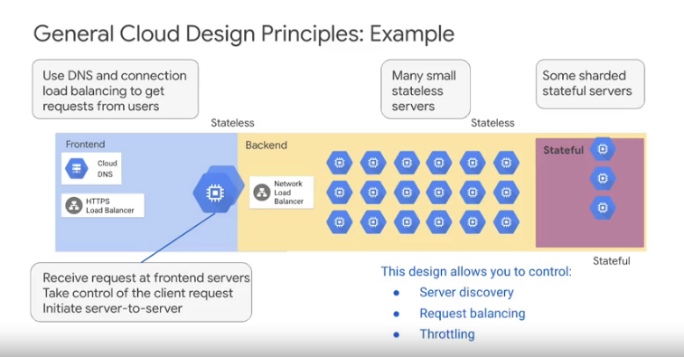
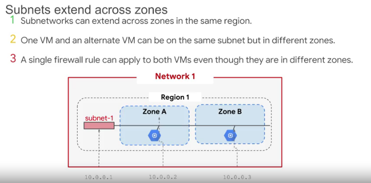
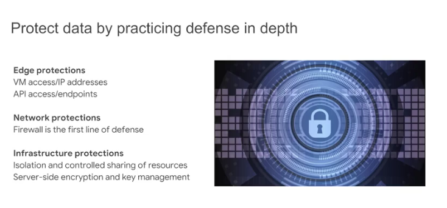
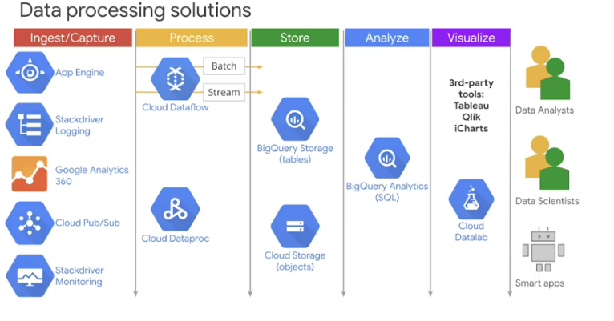
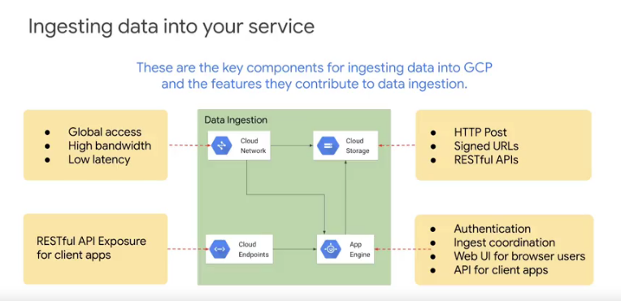

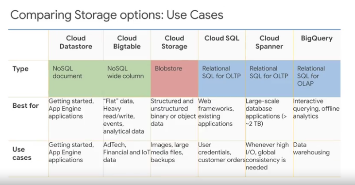
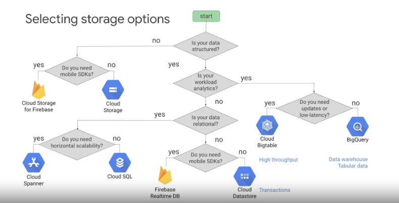
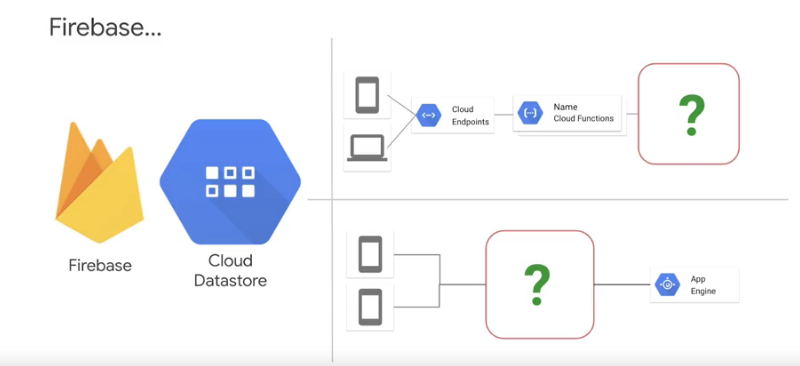
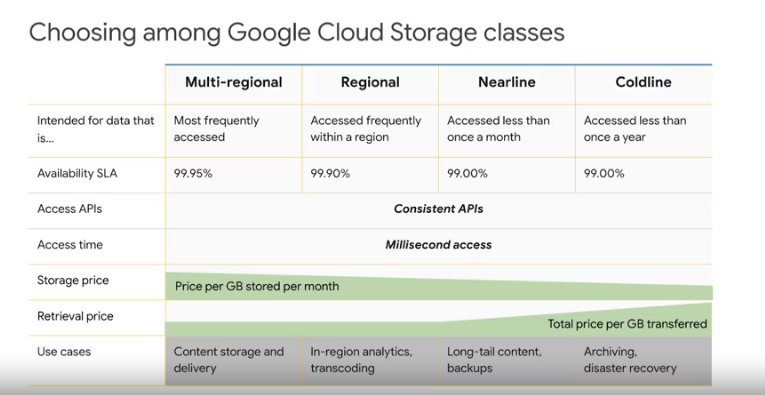
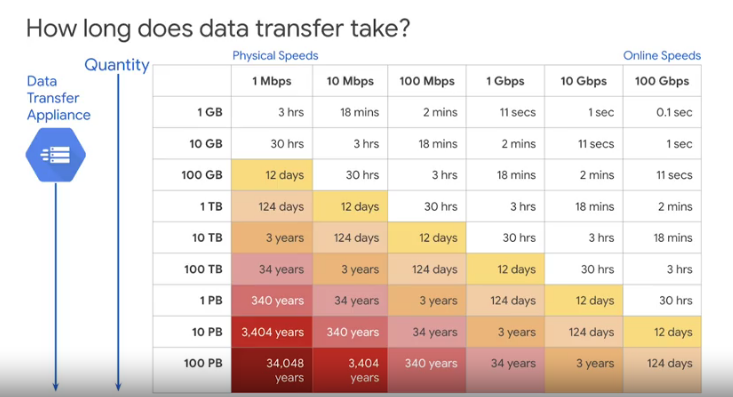
## Data processing to Machine Learning
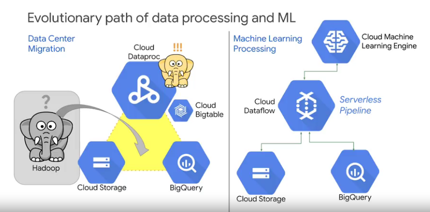
