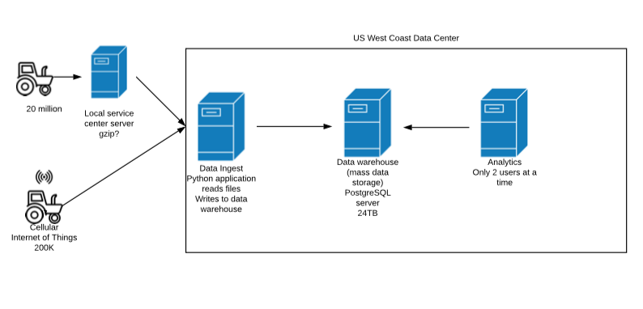
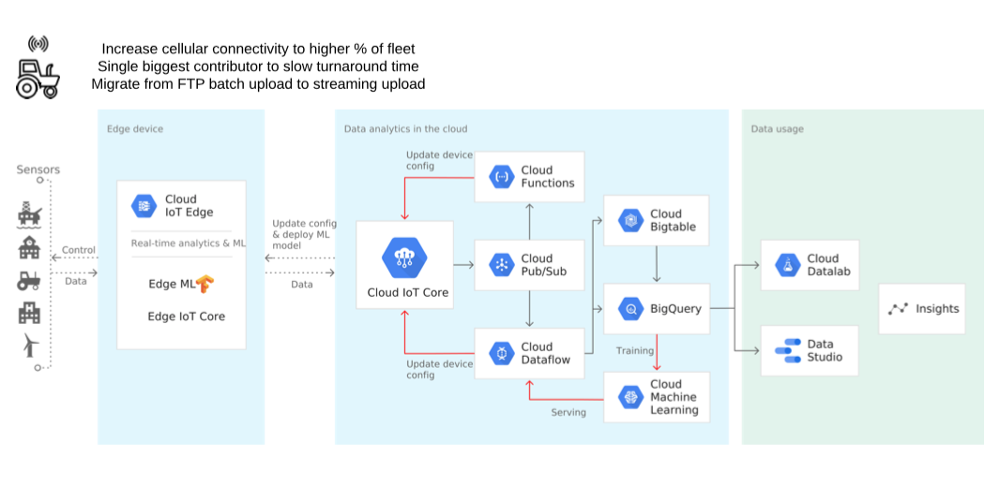
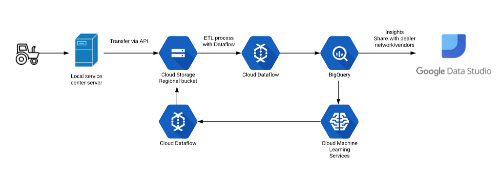
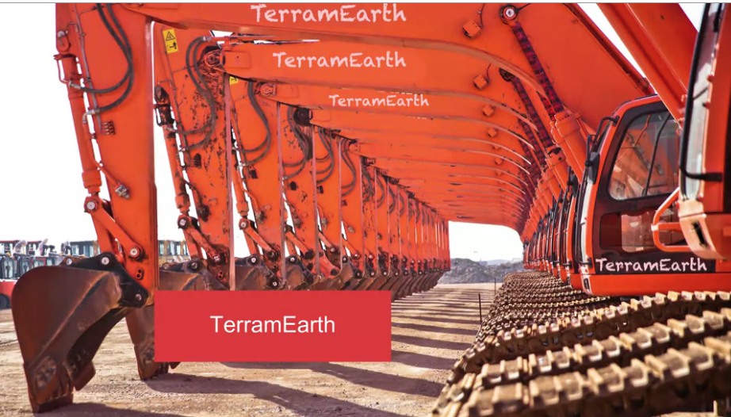
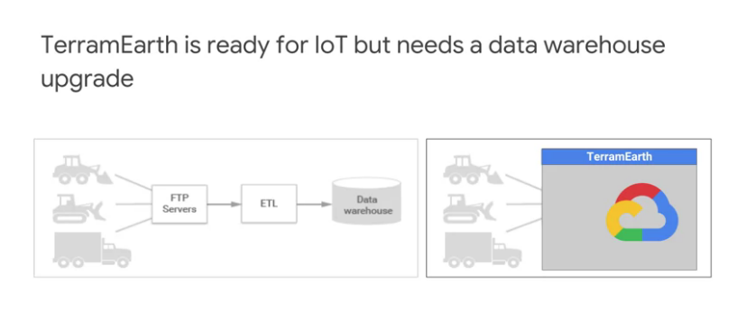
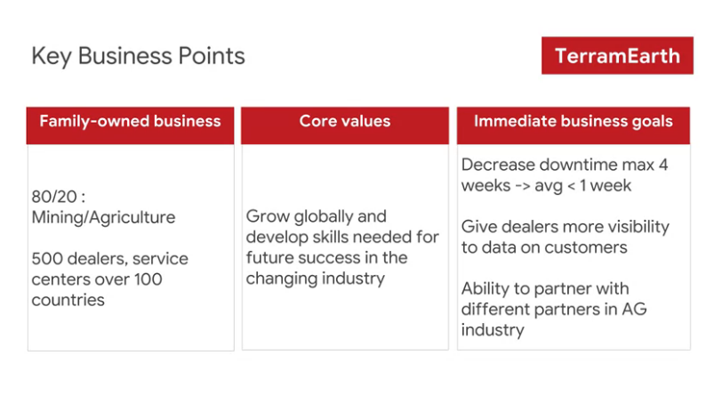
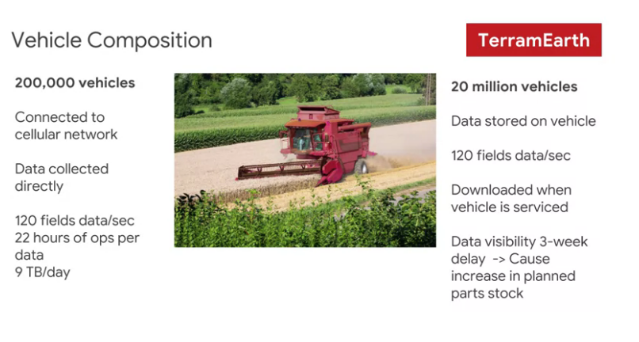
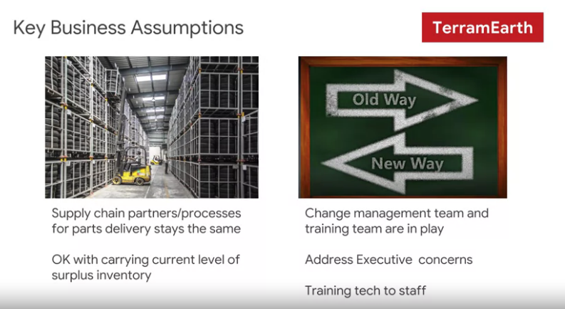
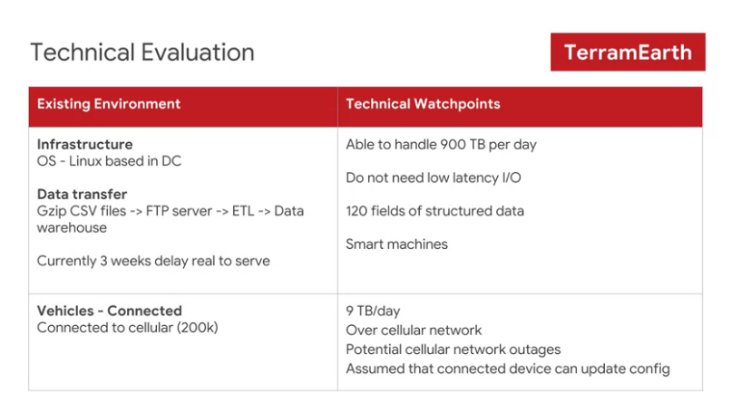
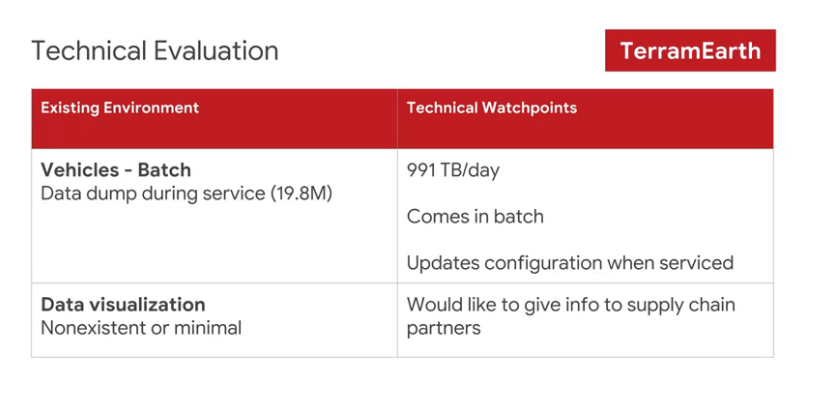

# Professional Cloud Architect - TerramEarth
This describes a fictitious business and solution concept to provide additional context to exam questions.

TerramEarth manufactures heavy equipment for the mining and agricultural industries. About 80% of their business is from mining and 20% from agriculture. They currently have over 500 dealers and service centers in 100 countries. Their mission is to build products that make their customers more productive.

## 1. Solution Concept

There are 20 million TerramEarth vehicles in operation that collect 120 fields of data per second. Data is stored locally on the vehicle and can be accessed for analysis when a vehicle is serviced. The data is downloaded via a maintenance port. This same port can be used to adjust operational parameters, allowing the vehicles to be upgraded in the field with new computing modules.

Approximately 200,000 vehicles are connected to a cellular network, allowing TerramEarth to collect data directly. At a rate of 120 fields of data per second, with 22 hours of operation per day, TerramEarth collects a total of about 9 TB/day from these connected vehicles.

## 2. Existing Technical Environment

TerramEarth’s existing architecture is composed of Linux and Windows-based systems that reside in a single U.S, west coast based data center. These systems gzip CSV files from the field and upload via FTP, and place the data in their data warehouse. Because this process takes time, aggregated reports are based on data that is 3 weeks old.

With this data, TerramEarth has been able to preemptively stock replacement parts and reduce unplanned downtime of their vehicles by 60%. However, because the data is stale, some customers are without their vehicles for up to 4 weeks while they wait for replacement parts.

## 3. Business Requirements

- Decrease unplanned vehicle downtime to less than 1 week

- Support the dealer network with more data on how their customers use their equipment to better position new products and services.

- Have the ability to partner with different companies—especially with seed and fertilizer suppliers in the fast-growing agricultural business—to create compelling joint offerings for their customers.

## 4. Technical Requirements

- Expand beyond a single datacenter to decrease latency to the American midwest and east coast

- Create a backup strategy

- Increase security of data transfer from equipment to the datacenter

- Improve data in the data warehouse

- Use customer and equipment data to anticipate customer needs

## 5. Application 1: Data ingest

A custom Python application reads uploaded datafiles from a single server, writes to the data warehouse

Compute:

- Windows Server 2008 R2
    
    - 16 CPUs
    
    - 128 GB of RAM
    
    - 10 TB local HDD storage

## 6. Application 2: Reporting

An off the shelf application that business analysts use to run a daily report to see what equipment needs repair. Only 2 analysts of a team of 10 (5 west coast, 5 east coast) can connect to the reporting application at a time.

Compute

- Off the shelf application. License tied to number of physical CPUs
    
    - Windows Server 2008 R2
    
    - 16 CPUs
    
    - 32 GB of RAM
    
    - 500 GB HDD

Data warehouse

- A single PostgreSQL server
    - RedHat Linux
    
    - 64 CPUs
    
    - 128 GB of RAM
    
    - 4x 6TB HDD in RAID 0

## 7. Executive Statement
Our competitive advantage has always been in our manufacturing process, with our ability to build better vehicles for lower cost than our competitors. However, new products with different approaches are constantly being developed, and I’m concerned that we lack the skills to undergo the next wave of transformations in our industry. My goals are to build our skills while addressing immediate market needs through incremental innovations.

---

---
# synopsys 
- heavy equipment, mining, agriculture
- bulldozers, tractors, etc.
- 500 dealers all over the world
- mission = make customers more productive

Current setup
- collect analytics on vehicles
    - increase efficiency
    - predict breakdowns and pre-stage replacement parts
- 20 million vehicles - each collecting 120 fields per second
- Data stored locally, then uploaded (batch upload) when at dealer
    - same port adjusts parameters
- 200,000 (10% of above) use cellular connection
    - Always streaming data
    - 9TB per day total upload

Problem to solve
- above setup allow TerramEarth to preemptively stock replacement parts = reduced downtime
    - however, turnaround time is about 4 weeks
    - needs to be 1 week
    - management priority = business agility
    
Additional notes
- have the ability to partner with different companies - especially with seed and fertilizer 
suppliers in the fast-growing agricultural business - to create compelling joint offerings for their customers.
    - use API for dealers and partners
    - APP Engine + Cloud Endpoints
- Data transfer to Google Cloud
    - IoT Core is latest capability to do so, can write directly to Pub/Sub
        - Able to handle massive data ingest 
        

---
## Sample solution

- Proposed product / solution
    - database
        - BigQuery for data warehouse and advanced analytics services
    - data processing
        - cloud dataflow to take care of ETL portion
    - machine learning
        - for updating configs
    - device management
        - cloud iot core
    - messaging
        - cloud pub/sub
    - device management
        - cloud iot core
        - iot devices -> cloud pub/sub
        - cloud dataflow -> cloud storage
    - message management
        - cloud storage for storing
        - dataflow runner job to get the batch data
    - data studio
    
---
TerramEarth manufacturers heavy equipment for the mining and agricultural industries. 
About 80 percent of their businesses is from mining and 20 percent from agriculture. 
They currently have over 500 dealers and service centers in 100 countries. 
Their mission is to build products that make their customers more productive. 
The workload is divided between nine terabytes per day delivered streaming over cell service. 
That's the IoT part, and 900 terabytes per day delivered via G zip CSV file. 
Currently, the G zip CSV data from the field takes about three weeks to make it into the data warehouse. 
That means some customers have vehicles out of service for four weeks waiting for parts. 
The company knows that IoT is coming and is preparing to meet the changes as traffic shifts from the file transfer model to the cell IoT model. 
However, the data warehouse is behind technically and also is not meeting customer business needs. 
They need a data warehouse upgrade that will handle both problems. 
The company provides heavy equipment through 500 dealers in 100 countries. 
One of the company goals is future-proofing, being prepared with skills and infrastructure to keep pace with changes in the industry. 
Immediate business goals are to decrease downtime. 
Downtime can currently run beyond four weeks. 
They would prefer to get this down to about one week with an average being between one week and four weeks. 
They want to give those 500 dealers greater access to customer data. 
For example, if the dealer knew that a particular machine was out of service often, they might want to approach a customer with an upgrade offer. 
The 20 percent of the business in agriculture vertical is a potential growth area. 
The company wants to be able to partner with others in that industry to expand their market. 
One way to do this is to be in the lead technologically. 
So, when there are inflection points in the market, TerramEarth can take advantage and enter new niches. 
This says it's about vehicles, but we can look at it as a way to understand the data demands it will be placed on the IT infrastructure. 
They have 200 thousand vehicles connected to sell networks that stream data at the rate of a 120 fields per second. 
They're on for 22 hours a day resulting in nine terabytes of data per day. 
They also have another 20 million vehicles that are not cell connected. 
The data is stored on the vehicle and downloaded when the vehicle is serviced. 
It takes quite a bit of time for the data to be uploaded and transformed. 
Currently, that process causes about a three week delay. 
To cover any parts that might be needed over a three week period, TerramEarth is forced to keep additional parts in stock. 
If the feedback were faster, their spare parts could more closely match the real demand and they could liberate some of the money that's currently invested in stock and sitting on shelves. 
A few key points. The first one is that this is not an ERP project. 
ERP is electronic resource planning. 
If you instrument your parts demand through your business and map it back to the supply chain, 
you can do things like order parts automatically when they're needed or even look at suppliers' 
inventory and preorder parts if there are not enough in stock. In any case, TerramEarth has decided that 
ERP should be an upgrade for another day. 
They'll stick with current surplus supply levels and maintain the same supply chain as today. 
They're happy just to provide visibility to supply partners. 
Change is already occurring in the management team through retraining management about emerging opportunities. 
TerramEarth realizes that the technical staff will need to be trained on the new systems and solutions. 
Moving the data warehouse to BigQuery will handle a lot of the main customer and business issues having to do with parts delay. 
It will need a frontend that can handle today's IoT demands and will grow and adapt to the changing 
categories of demand as more streaming solutions are employed and fewer file-based solutions. 
Keep in mind that Cloud IoT core doesn't suffice to get your data to cloud storage. 
Cloud IoT core brokers between IoT devices and Cloud Pub/Sub. 
You'll almost certainly want Cloud Dataflow to get the data to the next place. 
For vehicles that store and upload their data, the service will need to handle 900 terabytes of batch data transfer each day. 
Go ahead and define your solution. 
Consider how you would design this solution for a real customer. 
What are the questions you want to ask to help clarify your design? 
When you're ready, we'll look at one sample solution.    
        